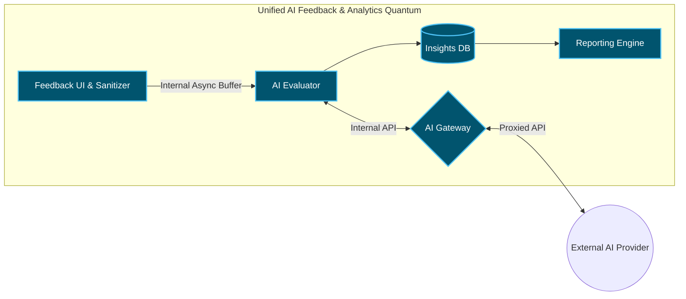
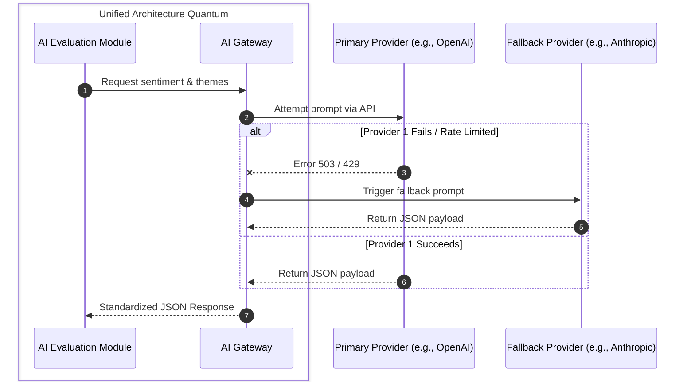

# ADR-004: Decoupled AI Pipeline for Visitor Feedback Evaluation & Reporting

**Date:** 2026-09-16
**Status:** Accepted

## Context
Von Digitalis Estates requires a feedback and reporting system to extract actionable insights from unstructured visitor feedback regarding the 40 historic rides and 55 animal enclosures. 

The system must support:
*   Feedback collection via mobile app and estate kiosks
*   PII (Personally Identifiable Information) sanitization
*   AI-driven sentiment analysis and theme extraction
*   AI-driven operational suggestions (e.g., "Increase staff at jumping piranhas")
*   Deterministic executive reporting and dashboards

Because connectivity across the estate is patchy, feedback collection must support offline operation. Furthermore, due to the rapid evolution and unpredictability of GenAI models, the system must survive AI provider outages, model deprecations, and price hikes.

---

## Alternatives

### Option 1 — Unified AI Pipeline with Abstraction Gateway (Chosen)
Treat the entire feedback lifecycle (from edge collection to cloud AI and reporting) as a **Single Unified Architecture Quantum**. It utilizes an internal asynchronous buffer to handle network drops, and a dedicated AI Gateway to own all external LLM interactions, ensuring the system remains highly cohesive.

*The AI Gateway acts as the single source of truth for routing, fallbacks, and cost-tracking, shielding the unified quantum from external volatility.*

### Option 2 — Direct Synchronous LLM Integration (Rejected)
The Collection UI synchronously calls the backend, which directly calls the OpenAI/Anthropic API.
*   **Problem:** Fatal dynamic connascence. If the AI provider is down, the visitor's app crashes.
*   **Problem:** High vendor lock-in.
*   **Problem:** PII leakage risk if sanitization fails in the synchronous loop.

---

## PrOACT (Trade-off Analysis)

| Requirement | Option 1: Unified & Abstracted (Chosen) | Option 2: Direct Sync Integration (Rejected) |
| :--- | :--- | :--- |
| **High Availability (Offline Collection)** | High (Buffered locally inside quantum) | Low (Fails on Wi-Fi/LLM drop) |
| **AI Change-Resilience (Vendor Swap)** | High (Config change at Gateway) | Low (Requires code rewrite) |
| **PII Security** | High (Stripped before buffer) | Medium (Risk of direct pass-through) |
| **Executive Reporting Reliability** | High (Queries structured DB) | Low (Subject to live hallucinations) |
| **System Complexity** | High (Requires internal buffers & gateways) | Low (Simple CRUD + API call) |

---

## Decision
We will implement the feedback and reporting pipeline as a **Single Unified Architecture Quantum**. While components are physically distributed between the Edge and the Cloud, they form a single, highly cohesive bounded context dedicated to generating actionable visitor insights. 

Within this unified quantum, responsibilities are logically modularized:

### 1. Edge Collection Module
**Responsibilities:**
*   Ingest raw text and ratings from visitors via mobile or kiosks.
*   Deterministically strip PII.
*   Store payload locally if the estate network drops.
*   Push sanitized feedback to the internal event broker when connected.

### 2. AI Evaluation & Gateway Module
**Responsibilities:**
*   Consume feedback events from the internal buffer.
*   Request sentiment and actionable suggestions via the AI Abstraction Gateway.
*   Manage AI model routing, failovers, and token cost tracking.
*   Parse non-deterministic JSON responses into structured data.
*   Persist structured insights to the Insights DB.

### 3. Deterministic Reporting Module
**Responsibilities:**
*   Query structured data from the Insights DB.
*   Serve deterministic reports (PDFs, dashboards) to Estate Management.
*   *Note: This module never calls the external LLM directly, avoiding the Vasa Anti-Pattern of over-complicating reporting with live AI.*

---

## Execution Flow (AI Evaluation Decision)
The AI Gateway is responsible for enforcing provider-agnostic rules and fallbacks, ensuring the unified quantum is never broken by an external third party.

---

## Offline & Failure Handling

Due to unreliable Wi-Fi across the sprawling estate, the unified quantum uses an internal buffer to prevent data loss.

**Connected State:**
`Submit Feedback` → `PII Strip` → `Push to Internal Broker` → `Cloud AI Evaluation`

**Connectivity Lost (Wi-Fi Drop):**
`Submit Feedback` → `PII Strip` → `Local Edge Cache` → `UI Success Message (Visitor continues day)`
*(When network restored)* → `Sync payload from Cache to Broker`

---

## Data Ownership

| Sub-Domain | Responsible Module | Data Store |
| :--- | :--- | :--- |
| **Raw Feedback** | Edge Collection | Local Edge SQLite Cache |
| **Sanitized Payload** | Message Broker | Internal MQTT / Kafka Log |
| **AI Insights/Sentiment** | AI Evaluation | Insights DB (PostgreSQL) |
| **Report Definitions** | Reporting | Insights DB (Read-Only) |

*Strict segregation ensures no module bypasses the DB schema to write data out of turn.*

---

## Communication Strategy

**Use synchronous APIs for deterministic user interactions:**
*   Visitor submitting a form (Local edge compute).
*   The Countess viewing a dashboard.
*   Internal AI Evaluator calling the AI Gateway.

**Use internal asynchronous events to buffer volatility:**
*   Pushing collected, sanitized feedback from the Edge nodes to the Cloud processing engine.

---

## Trade-offs & Mitigations

| Trade-off | Mitigation |
| :--- | :--- |
| **AI Gateway becomes a single point of failure** | Deploy Gateway in HA (Highly Available) clusters with horizontal scaling within the cloud partition. |
| **Async buffering means insights aren't instant** | Accept eventual consistency; executive reports are generated batch/hourly, not second-by-second. |
| **LLMs return malformed JSON disrupting the DB** | AI Gateway enforces strict JSON schema validation before passing data back to the Evaluator. |
| **Offline caches could fill up storage on Edge devices** | Implement aggressive compression and TTL (Time to Live) on edge caches, alerting maintenance if limits approach. |