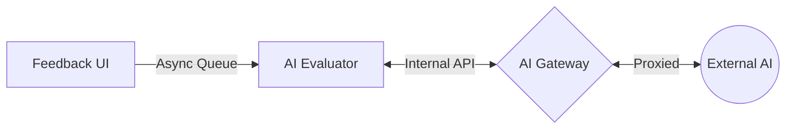
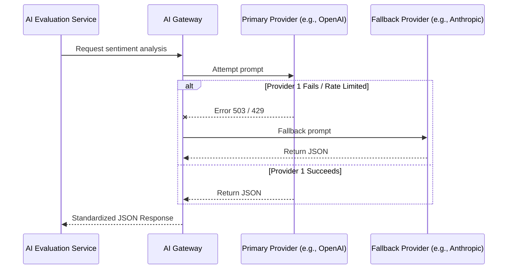

# ADR-004: Decoupled AI Pipeline for Visitor Feedback Evaluation & Reporting

**Date:** 2026-09-15
**Status:** Proposed

## Context
Von Digitalis Estates requires a feedback and reporting system to extract actionable insights from unstructured visitor feedback regarding the 40 historic rides and 55 animal enclosures. 

The system must support:
*   Feedback collection via mobile app and estate kiosks
*   PII (Personally Identifiable Information) sanitization
*   AI-driven sentiment analysis and theme extraction
*   AI-driven operational suggestions (e.g., "Increase staff at jumping piranhas")
*   Deterministic executive reporting and dashboards

Because connectivity across the estate is patchy, feedback collection must support offline operation. Furthermore, due to the rapid evolution and unpredictability of GenAI models, the system must survive AI provider outages, model deprecations, and price hikes.

---

## Alternatives

### Option 1 — Decoupled AI Pipeline with Abstraction Gateway (Chosen)
Use an asynchronous queue to decouple collection from processing, and a dedicated AI Gateway to own all external LLM interactions.

*The AI Gateway acts as the single source of truth for routing, fallbacks, and cost-tracking.*

### Option 2 — Direct Synchronous LLM Integration (Rejected)
The Collection UI synchronously calls the backend, which directly calls the OpenAI/Anthropic API.
*   **Problem:** Fatal dynamic connascence. If the AI provider is down, the visitor's app crashes.
*   **Problem:** High vendor lock-in.
*   **Problem:** PII leakage risk if sanitization fails in the synchronous loop.

---

## PrOACT (Trade-off Analysis)

| Requirement | Option 1: Decoupled & Abstracted (Chosen) | Option 2: Direct Sync Integration (Rejected) |
| :--- | :--- | :--- |
| **High Availability (Offline Collection)** | High (Queued locally) | Low (Fails on Wi-Fi/LLM drop) |
| **AI Change-Resilience (Vendor Swap)** | High (Config change at Gateway) | Low (Requires code rewrite) |
| **PII Security** | High (Stripped before queue) | Medium (Risk of direct pass-through) |
| **Executive Reporting Reliability** | High (Queries structured DB) | Low (Subject to live hallucinations) |
| **System Complexity** | High (Requires queues & gateways) | Low (Simple CRUD + API call) |

---

## Decision
We will implement three core services with clear aggregate ownership, dividing the system into two distinct Architecture Quanta.

### 1. Feedback Service (Quantum 1: Edge / High Availability)
**Owns:** Raw Feedback, Sanitization Rules
**Responsibilities:**
*   Ingest raw text and ratings from visitors
*   Deterministically strip PII
*   Store payload locally if offline
*   Publish sanitized feedback to the Event Broker

### 2. AI Evaluation Service (Quantum 2: Cloud / Scalable)
**Owns:** AI Prompts, Sentiment Scores, Extracted Themes
**Responsibilities:**
*   Consume async feedback events
*   Request sentiment and actionable suggestions via the AI Gateway
*   Parse non-deterministic JSON responses into structured data
*   Persist structured insights to the DB

### 3. Reporting Service (Quantum 2: Cloud / Scalable)
**Owns:** Dashboards, PDF Reports
**Responsibilities:**
*   Query structured data from the Insights DB
*   Serve deterministic reports to Estate Management
*   *Note: This service never calls the LLM directly.*

---

## Execution Flow (AI Evaluation Decision)
The AI Gateway is responsible for enforcing provider agnostic rules and fallbacks.

---

## Offline & Failure Handling

Due to unreliable Wi-Fi, Feedback Collection will not depend exclusively on a live cloud request.

**Connected State:**
`Submit Feedback` → `PII Strip` → `Publish to MQTT/Kafka` → `Cloud AI Evaluation`

**Connectivity Lost (Wi-Fi Drop):**
`Submit Feedback` → `PII Strip` → `Local SQLite Cache` → `UI Success Message`
*(When restored)* → `Sync payload to MQTT/Kafka`

---

## Data Ownership

| Aggregate | Service | Database |
| :--- | :--- | :--- |
| **Raw Feedback** | Feedback Service | Local Edge Cache |
| **Sanitized Payload** | Event Broker | MQTT / Kafka Log |
| **AI Insights/Sentiment** | AI Evaluation Service | Insights DB (PostgreSQL) |
| **Report Definitions** | Reporting Service | Insights DB (Read-Only) |

*No service directly updates another service's database.*

---

## Communication Strategy

**Use synchronous APIs for deterministic reads/writes:**
*   Visitor submitting a form (Edge local)
*   The Countess viewing a dashboard
*   AI Evaluator calling the internal AI Gateway

**Use asynchronous events (MQTT/Kafka) to break connascence:**
*   Pushing collected feedback from the Edge to the Cloud
*   Triggering report generation alerts

**Example:**
`estate/feedback/collected` (MQTT Topic)
`estate/insights/{insightId}` (REST API)

---

## Trade-offs & Mitigations

| Trade-off | Mitigation |
| :--- | :--- |
| **AI Gateway becomes a single point of failure** | Deploy Gateway in HA (Highly Available) clusters with horizontal scaling. |
| **Async events mean feedback isn't instantly in reports** | Accept eventual consistency; reports are generated batch/hourly anyway. |
| **LLMs return malformed JSON disrupting the DB** | AI Gateway enforces strict JSON schema validation before returning to Evaluator. |
| **Offline queues could fill up storage on Edge devices** | Implement TTL (Time to Live) and aggressive compression on local edge caches. |