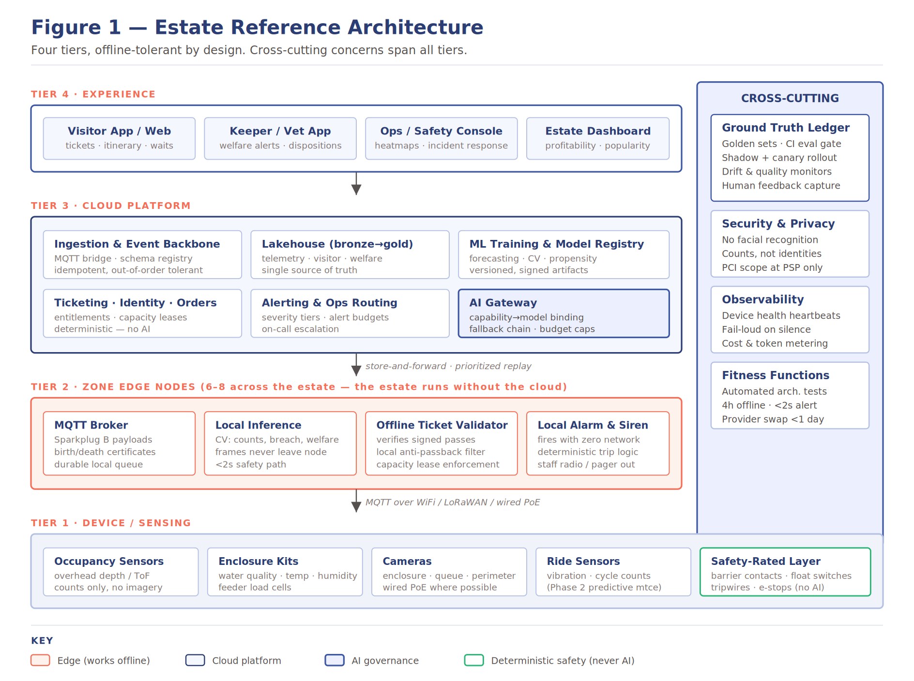
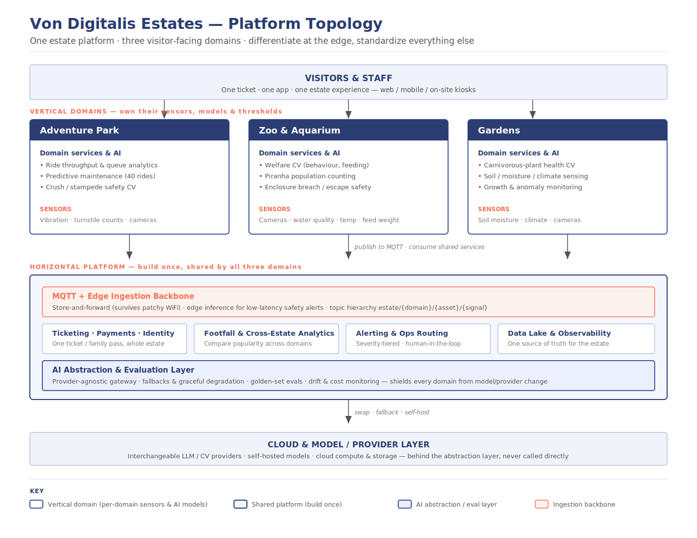
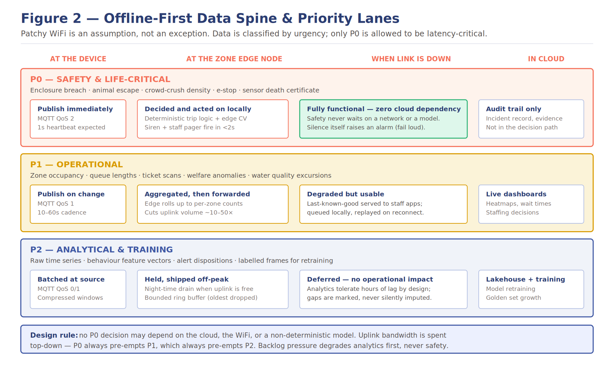
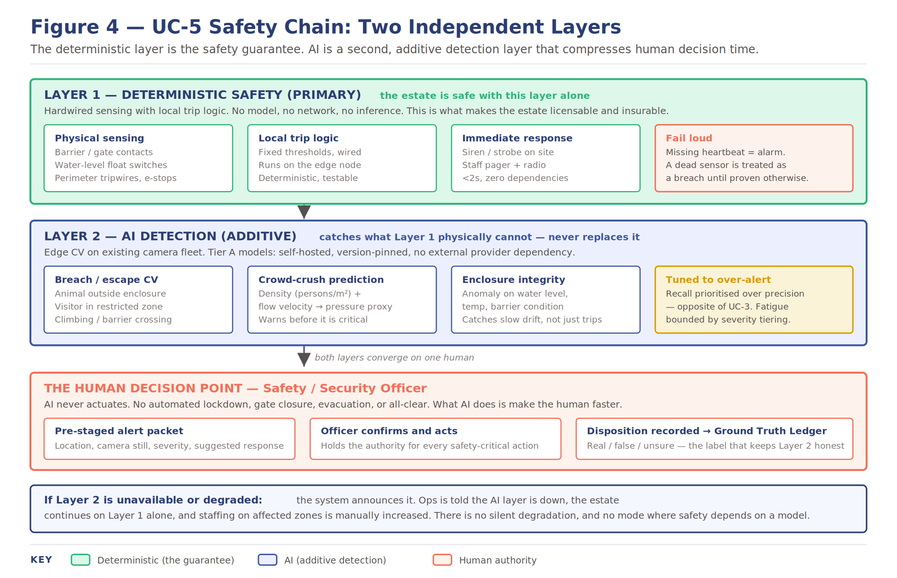
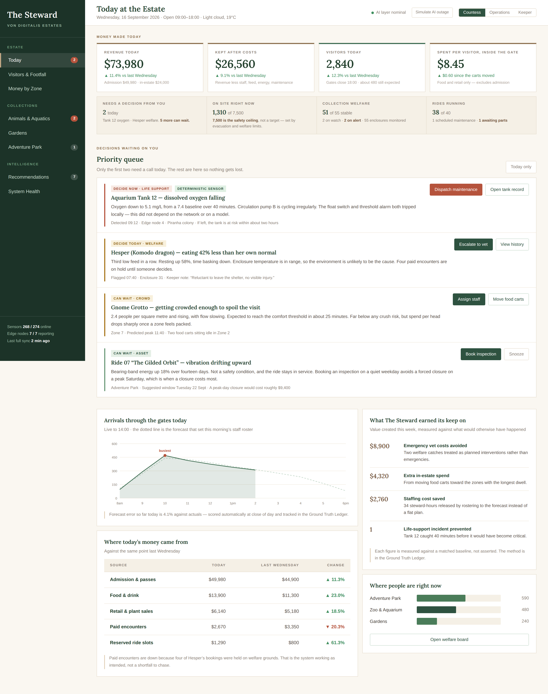
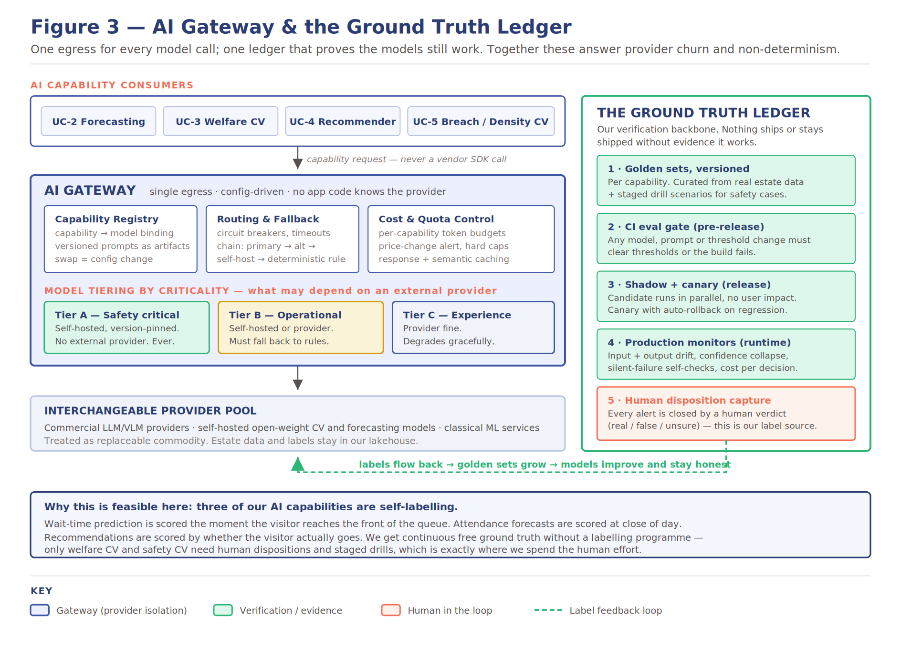
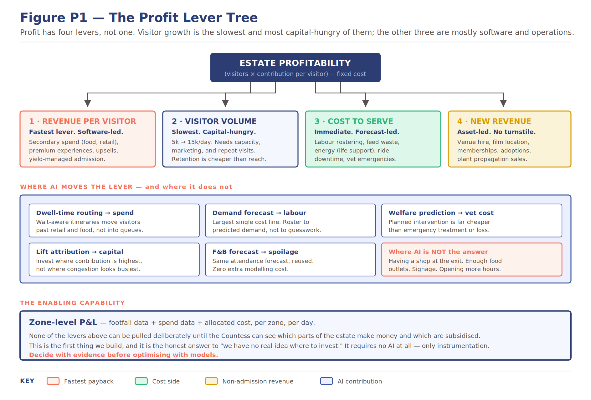

# Von Digitalis Estates — Team Ground Truth

**O'Reilly Architectural Katas 2026 — AI-Assisted Software Architecture**

The 72nd Countess Von Digitalis has inherited a sprawling estate and a family business. They need the estate to become profitable, safe and well-run, on a property where the Wi-Fi cannot be trusted and the AI landscape will have changed by the time anything ships.

## Quick links

| What                              | Where                                                                                                                  |
|---------------------------------------|----------------------------------------------------------------------------------------------------------------------------|
| Interactive admin dashboard prototype | [The Steward — live prototype](https://santhosh-challa.github.io/ground-truth/prototype/the-steward-dashboard.html) |
| Dashboard screenshots                 | [prototype/screens/](prototype/screens/)                                                                     |
| Architecture decision records         | [ADR/](ADR/) and the [ADR index](#architecture-decision-records)                                    |
| Per-use-case detail                   | [usecases/](usecases/)                                                                                       |
| Brainstorming artifacts               | [other-artifacts/](other-artifacts/)                                                                         |
| How this meets the judging criteria   | [Traceability table](#how-this-submission-addresses-the-judging-criteria)                                           |

## Contents

- [Team](#team)
- [Why we are called Ground Truth](#why-we-are-called-ground-truth)
- [Glossary](#glossary)
- [1. The business problem](#1-the-business-problem)
- [2. How we worked](#2-how-we-worked)
- [3. Business outcomes we are designing for](#3-business-outcomes-we-are-designing-for)
- [4. Solution overview](#4-solution-overview)
- [5. Architectural quanta](#5-architectural-quanta)
- [6. Architecture characteristics and fitness functions](#6-architecture-characteristics-and-fitness-functions)
- [7. Prioritized use cases](#7-prioritized-use-cases)
- [8. Safety of the public, the animals and the plants](#8-safety-of-the-public-the-animals-and-the-plants)
- [9. Cross-cutting capabilities](#9-cross-cutting-capabilities)
- [10. The admin dashboard — The Steward](#10-the-admin-dashboard--the-steward)
- [11. Dealing with uncertainty in AI](#11-dealing-with-uncertainty-in-ai)
- [12. Does it work? Validation and verification](#12-does-it-work-validation-and-verification)
- [13. Making the estate profitable](#13-making-the-estate-profitable)
- [14. Assumptions and capacity planning](#14-assumptions-and-capacity-planning)
- [15. Risk register](#15-risk-register)
- [16. Roadmap](#16-roadmap)
- [17. What we deliberately did not do](#17-what-we-deliberately-did-not-do)
- [18. 3 Key learnings](#18-3-key-learnings)
- [Architecture decision records](#architecture-decision-records)
- [Diagram index](#diagram-index)
- [Actors](#actors)
- [How this submission addresses the judging criteria](#how-this-submission-addresses-the-judging-criteria)

## Team

We are a group of product and engineering practitioners at [Zemoso Technologies](https://www.zemosolabs.com/).

| Name                | Role                    | Profile                                                            |
|-------------------------|-----------------------------|------------------------------------------------------------------------|
| Ranjith DVL             | Product Manager             | [LinkedIn](https://www.linkedin.com/in/ranjithdvl/)             |
| Santosh Kumar Challa    | Senior Tech Lead            | [LinkedIn](https://www.linkedin.com/in/skchalla/)               |
| Sourav Pujara           | Principal Software Engineer | [LinkedIn](https://www.linkedin.com/in/sourav-pujara-b2874762/) |
| Sanket Kisan Raut       | Principal Software Engineer | [LinkedIn](https://www.linkedin.com/in/sanketkraut)             |
| Mohammad Faizan Haidery | Senior DevOps Engineer      | [LinkedIn](https://linkedin.com/in/faizanhaidery)               |

We drafted different parts of the design in parallel to cover ground, but every use case, diagram and ADR was reviewed by the whole team before it landed here. The boundaries between use cases were decided together, and several of the strongest ideas in this repository came out of arguments between people who were not drafting that section.

## Why we are called Ground Truth

The hardest problem in this brief is not building AI features. It is proving they still work once they are live, non-deterministic, and nobody is watching.

Our team name is also our architectural thesis:

> *Every AI capability we deploy is paired with a mechanism that produces ground truth to score it against. Where ground truth is expensive to obtain, we either do not use AI, or we do not let AI make the decision.*

That one rule shapes every design decision in this repository. It is why ticketing has no AI in it at all, why the safety system works with every model switched off, and why the visitor-facing features we backed hardest are the ones that generate their own labels for free.

## Glossary

| Term            | Meaning                                                                                |
|---------------------|--------------------------------------------------------------------------------------------|
| Estate              | The whole Von Digitalis property: adventure park, zoo and aquarium, gardens and grounds    |
| Zone                | An instrumented area used for occupancy, analytics and cost allocation                     |
| Edge node           | On-premise compute serving a zone; runs the local broker, inference and trip logic         |
| MQTT / Sparkplug B  | Sensor messaging protocol; Sparkplug B adds device birth and death certificates            |
| P0 / P1 / P2        | Data priority lanes: safety-critical, operational, analytical                              |
| Tier A / B / C      | Model criticality tiers deciding what may depend on an external AI provider                |
| Quantum             | An independently deployable unit with high functional cohesion and synchronous connascence |
| Aggregate           | A cluster of domain objects treated as a single unit for data changes                      |
| Ground Truth Ledger | Our verification subsystem: golden sets, eval gates, drift monitors, human dispositions    |
| The Steward         | The admin dashboard. Historically the steward ran an estate on behalf of its titled owner  |
| Welfare gate        | Control that suspends paid animal encounters when welfare indicators leave baseline        |
| Disposition         | A human verdict on an AI alert (real, false, unsure) captured as a training label          |
| Dwell time          | Time a visitor spends in a zone. Our measure of interest, as opposed to headcount          |

## 1. The business problem

### Context

The family trade, highly explosive garden gnomes, is no longer viable. The Countess wants to bring digital solutions to monetize parts of the estate before she is forced to sell the family's carnivorous plant collection.

The estate has three visitor-facing areas:

| Area         | Scale                                                                       |
|------------------|---------------------------------------------------------------------------------|
| Adventure Park   | 40 historically important 18th-century rides, recently passed safety inspection |
| Zoo and Aquarium | 200+ exotic and poisonous animals across 55 enclosures, aquatic and land-based  |
| Gardens          | Carnivorous plant collections across glasshouses and beds                       |

Roughly 5,000 visitors a day today, with a target of at least 15,000 within three years.

### What the Countess asked for

1.  A way for people to buy tickets, including family passes
2.  Understanding of which parts of the estate are popular, so she knows where to invest and deploy staff
3.  Careful monitoring of the animal collection: health, feeding, and population counts for the jumping piranhas
4.  A way to grow visitor numbers and make the estate more profitable

### The business challenges she named

- No real idea which parts of the estate are most popular, so investment and staffing are guesswork
- Looking after the animals is costly, and much more so when they fall ill
- More returning visitors are wanted, but nobody knows how to produce them

### Technical constraints from the brief

- Wi-Fi coverage across the park is patchy
- Cloud services may be used, but data has to reliably get from the estate to the cloud
- There is budget for MQTT-capable hardware devices installed throughout the park

### Our framing of the objective

> How might we use AI, only where it genuinely earns its place, to make the Von Digitalis Estates safe, well-run and profitable, on an estate where the network cannot be trusted and the AI landscape will change within months?

## 2. How we worked

We ran three structured exercises before drawing a single box on an architecture diagram. The artifacts from each are in [other-artifacts/](other-artifacts/).

### 2.1 Actor-action and event storming hybrid

We started from the people, not the technology. For every actor we listed the actions they take, the event each action produces, and the aggregate that event touches. Working forward from actions to events stopped us inventing services nobody needed, and it surfaced actors the brief never names.

The actors we identified: Visitor, Ticket Collector and Booking Admin, Vet Staff, Care Taker, Plants Expert, Rides Operator, Estate Manager, System, and AI System.

A sample of the chains this produced:

| Actor      | Action                                                  | Event                                        | Aggregate                      |
|----------------|-------------------------------------------------------------|--------------------------------------------------|------------------------------------|
| Visitor        | Create family pass, visit the estate                        | Ticket created                                   | Ticket                             |
| Booking admin  | Check pass validity, report incident, Issue refund          | Pass validated, incident reported, refund issued | Ticket, incident, control, refunds |
| Vet staff      | Get animal health                                           | Animal health fetched                            | Animal, AnimalHealthRecord         |
| Care taker     | Report health information                                   | Health info updated                              | HealthRecord, SensorRecord         |
| Rides operator | Get machine health, operate rides                           | Machine health fetched, rides monitored          | Machines, rides                    |
| Plants expert  | Update plants health                                        | Plants health updated                            | PlantHealthRecord                  |
| Estate manager | Get popularity metrics, update staff assignments            | Popularity metrics fetched, staff assigned       | Zone, Roster                       |
| AI system      | Evaluate animal health data, escalate to human for approval | Animal data evaluated, approval sent             | Animal, Sensor Record              |
| Evals          | Evaluate AI agent outputs                                   | Corrections identified                           | AI Model                           |

Two things fell out of this exercise that shaped the whole design.

The first is that **the AI System is an actor, not a layer**. Once we wrote it in the same column as the vet and the rides operator, it became obvious that every one of its actions had to terminate in either a human approval step or a recorded evaluation. That is where "escalate to human for approval" and the separate Evals actor came from, and it is the origin of the Ground Truth Ledger.

The second is that **care takers and vets need to record what they see offline, without typing forms**. That requirement came out of the actor work rather than the brief, and it drove the offline-first posture of the keeper tooling.

### 2.2 Aggregate identification

The event storming gave us the aggregates directly:

User, User Profile, Ticket, Payment, Visit, Incident, Animal, AnimalHealthRecord, HealthRecord, FeedingRecord, Enclosure, Plant, PlantHealthRecord, Ride, Machine, Sensor, SensorRecord, Zone, Roster, Report, Notification, Scheduler (Job), AI Model, ModelProvider, ModelRouter.

### 2.3 Quanta identification

We then grouped aggregates and services into architectural quanta, using high functional cohesion, similar architectural characteristics and synchronous dependencies as the grouping test. The result is in [section 5](#5-architectural-quanta). This exercise is what told us the estate is not one system and not three systems, but six independently deployable units with genuinely different characteristics, which is the substance behind [Platform Topology](business-requirements/Platform Topology.md).

### 2.4 Use case prioritization

We put every candidate capability on a board, grouped them, and cut to five prioritized use cases plus three cross-cutting capabilities that sit over all of them.

Prioritized:

1.  Ticket and booking system
2.  Animals and plants sensor data, including safety
3.  Footfall analytics
4.  Feedback collection and assessment

Cross-cutting:

5.  Growth and retention
6.  Ingestion, turning existing paper records into structured data
7.  Alert notifications and the notification service
8.  Admin dashboard

Each of the four carries a C2 diagram, a data flow and its own ADRs.

### 2.5 The four tests every idea had to survive

We cut ideas that were clever but fragile. To stay in the design, an idea had to survive a dropped network, a tripled visitor count, a model provider disappearing overnight, and a judge asking how we know it works.

### 2.6 The AI necessity test

We do not force-fit AI. Each use case carries an explicit verdict, and where deterministic rules or plain software do the job better, we say so and leave AI out.

| Verdict             | Meaning                                                                |
|-------------------------|----------------------------------------------------------------------------|
| Load-bearing            | Only AI can do this. A capability gap nothing else closes                  |
| Enhancement             | AI improves it, but a good non-AI fallback exists and is used              |
| Augments, never decides | A deterministic layer is primary. AI adds reach but never authority        |
| Deliberately AI-free    | Rules and cryptography do this better. Adding AI would add risk, not value |

Across the four prioritized use cases, AI is load-bearing in three, an enhancement in one, and deliberately absent from one. Safety falls in the third category. Stating that distribution openly is the opposite of AI-washing, and we think it is a more honest answer than claiming AI everywhere.

## 3. Business outcomes we are designing for

> **A note on these numbers.** The brief gives us visitor volumes and asset counts but no financials. The figures below are **our own explicit assumptions**, built into a model rather than measured. We have stated them openly so judges can see the reasoning and challenge the arithmetic. Every one would be replaced with the estate's actuals on day one, and the zone-level P&L described in section 13 exists precisely so that replacement is possible.

### The central commercial argument

The stated goal is 5,000 to 15,000 visitors a day. Taken alone, we think that framing is a trap. Tripling visitors is the slowest, most capital-intensive and riskiest of the available levers. It needs capacity, parking, marketing spend, more staff and more animals under pressure.

The estate can become profitable at a fraction of 15,000 visitors a day by raising revenue per visitor and cutting cost to serve, both of which are largely software and operations problems rather than construction problems. Visitor growth then compounds a business that already works, instead of scaling one that loses money per head.

### The arithmetic behind that claim

Assumed, for illustration:

| Assumption                                                  | Value |
|-----------------------------------------------------------------|-----------|
| Blended admission per visitor                                   | \$18      |
| Current in-estate spend per visitor (food, retail, experiences) | \$4       |
| Current revenue per visitor                                     | \$22      |
| Target in-estate spend per visitor                              | \$12      |
| Target revenue per visitor                                      | \$30      |
| Operating days per year                                         | 300       |

At 5,000 visitors a day that is 1.5 million visits a year, so **every \$1 of additional per-visitor spend is worth roughly \$1.5 million a year**. Lifting in-estate spend from \$4 to \$12 is a 35% revenue increase with the same number of visitors through the gate. Achieving the same uplift through volume alone would mean finding 1,750 additional visitors every single day.

We present this as a model, not a forecast. The point is the structure and the sensitivity.

### Outcomes by lever

| Outcome         | Lever                                                                        | Our design target                            |
|---------------------|----------------------------------------------------------------------------------|--------------------------------------------------|
| Revenue per visitor | In-estate spend driven by dwell-aware routing and paid experiences               | \$22 to \$30                                     |
| Cost to serve       | Staff rostered to forecast demand instead of a flat plan                         | Reduce the largest addressable cost line         |
| Animal care cost    | Welfare deviation caught days earlier: planned intervention instead of emergency | Convert emergency spend into planned spend       |
| Visitor growth      | Capacity, retention and off-peak demand                                          | 5,000 to 15,000 per day over three years         |
| Returning visitors  | Membership and wait-aware itineraries                                            | Raise repeat share as the primary growth engine  |
| Safety incidents    | Two-layer detection with a deterministic primary layer                           | Zero tolerance. This is a licensing precondition |

## 4. Solution overview

### The thesis

The estate is a physically distributed, network-hostile environment where a handful of decisions are safety-critical and most are not. That asymmetry drives the whole design.

- One shared platform with domain modules, not three separate platforms and not a monolith.
- Patchy Wi-Fi treated as the normal operating condition. Zone edge nodes run the estate; the cloud is where we learn, not where we operate
- Every data flow classified into P0 safety, P1 operational, P2 analytical, so scarce bandwidth degrades analytics first and safety never
- Every model call behind one AI Gateway, so a provider price change, deprecation or shutdown is a configuration change
- Models tiered by criticality. Anything safety-critical is self-hosted and version-pinned with a deterministic fallback
- Verification built as a running system rather than a test phase

### Figure 1. Reference architecture

Four tiers. The important property is where decisions are made: the further down the stack a decision sits, the less it can be disrupted. Safety decisions live at the bottom, learning lives at the top.

### Figure 2. Platform topology

Should the estate be split into separate platforms per area, or run as one? Neither extreme. We adopt a shared horizontal platform with vertical domain modules: build the backbone once, differentiate only at the sensor and model layer where the domains genuinely diverge. Segregation is logical, through the MQTT topic hierarchy, not physical. Captured in full in Platform Topology

### Figure 3. Offline-first data spine and priority lanes

Patchy Wi-Fi is the constraint most likely to sink a naive design, so we addressed it structurally rather than with retries.

A single queue would mean a backlog of low-value telemetry could delay a safety event. Separating lanes lets us make a guarantee we can defend: bandwidth pressure degrades analytics first, operations second, and safety never, because safety does not traverse the uplink to be decided at all.

**Design rule:** no P0 decision may depend on the cloud, the Wi-Fi, or a non-deterministic model.

## 5. Architectural quanta

An architecture quantum is an independently deployable artifact with high functional cohesion and synchronous connascence. Identifying them told us where the real seams in this system are, and let each part carry its own architectural characteristics rather than forcing one set across the whole estate.

| Quantum  | Services                                                  | Aggregates                                                                                                   | Driving characteristics                                         |
|--------------|---------------------------------------------------------------|------------------------------------------------------------------------------------------------------------------|---------------------------------------------------------------------|
| Ticket       | User Service, Ticket Service, Payment Service, Visit Service  | User, User Profile, Ticket, Payment, Visit                                                                       | Availability, recoverability                                        |
| Estate       | Plant Service, Ride Service, Staffing Service, Animal Service | Plant, PlantHealthRecord, Ride, Zone, Roster, Enclosure, Animal, AnimalHealthRecord, FeedingRecord, HealthRecord | Fault tolerance, workflow, accuracy, explainability, recoverability |
| Device Data  | Device Service                                                | Machine, Sensor, SensorRecord                                                                                    | Workflow, fault tolerance                                           |
| Job          | Scheduler Service                                             | Schedule (Job)                                                                                                   | Workflow                                                            |
| AI Gateway   | AI Gateway Service                                            | AI Model, ModelProvider, ModelRouter                                                                             | Accuracy, explainability, observability                             |
| Notification | Notification Service, Report Service                          | Incident, Notification, Report                                                                                   | Availability, recoverability                                        |

Two observations worth calling out.

The **Estate quantum** is deliberately the largest. Plants, rides, staffing and animals share synchronous dependencies through zones and rosters, and separating them would have created chatty cross-quantum calls for no benefit. It carries the heaviest characteristic load in the system because it is where welfare, safety and operations meet.

The **AI Gateway is its own quantum**. Its characteristics are completely different from everything around it, accuracy and explainability and observability rather than availability and recoverability, and it changes on a completely different cadence because the model landscape moves faster than the estate does. Isolating it is what makes the provider-swap story in section 11 credible rather than aspirational.

## 6. Architecture characteristics and fitness functions

The brief asks whether the architectural characteristics of AI additions match the existing architecture. We answered that by naming the characteristics first and making each one automatically testable, so an AI feature fails a build exactly as a functional regression would.

| Characteristic   | Target                                                                                    | Fitness function                                                                                                                         |
|----------------------|-----------------------------------------------------------------------------------------------|----------------------------------------------------------------------------------------------------------------------------------------------|
| Offline tolerance    | Full estate operation for at least 4 hours with no cloud link; safety unaffected indefinitely | Chaos test severs a zone node's uplink in staging. Assert ticketing, counting and safety trips continue and the backlog replays without loss |
| Safety latency       | Detection to on-site alarm under 2 seconds, at the edge                                       | Synthetic trip injection measures end-to-end latency nightly per zone node                                                                   |
| Elasticity           | Threefold visitor growth with no re-architecture                                              | Load test entry, app and telemetry paths at 3x peak. Assert p95 latency and cost per visitor stay within envelope                            |
| Provider portability | Swap any Tier B or C provider within one working day, configuration only                      | Contract tests run every capability against a second provider weekly                                                                         |
| Verifiability        | Every AI decision traceable to inputs, model version and prompt version                       | Audit sampler reconstructs lineage for random production decisions                                                                           |
| Cost predictability  | Inference spend bounded, alerting before overrun                                              | Gateway budget caps enforced at runtime, nightly variance report                                                                             |
| Privacy              | No biometric identification anywhere; imagery does not leave the edge except on incident      | Static scan for face-recognition APIs; egress test asserts no frame payloads on P1 or P2 lanes                                               |

[github workflows](.github/workflows/fitness-functions.yml)

[Fitness test cost-predictability](fitness-tests/cost-predictability.sh)

[Fitness test elasticity](fitness-tests/elasticity.sh)

[Fitness test: offline tolerance](fitness-tests/offline-tolerance.sh)

[Fitness test: privacy](fitness-tests/privacy.sh)

[Fitness test: provider portability](fitness-tests/provider-portability.sh)

[Fitness test: safety latency](fitness-tests/safety-latency.sh)

[Fitness test verifiability](fitness-tests/verifiability.sh)

[Fitness test architecture-fitness-functions](fitness-tests/architecture-fitness-functions.sh)

## 7. Prioritized use cases

Five prioritized use cases. Each has a C2 diagram, a data flow and its own ADRs.

| # | Use case                                                                        | AI necessity                                  |
|--------|-------------------------------------------------------------------------------------|---------------------------------------------------|
| 1      | [Ticket and booking system](#71-ticket-and-booking-system)                   | Deliberately AI-free                              |
| 2      | [Animals and plants sensor data](#72-animals-and-plants-sensor-data)         | Load-bearing                                      |
| 3      | [Footfall analytics](#73-footfall-analytics)                                 | Load-bearing, classical ML rather than generative |
| 4      | [Feedback collection and assessment](#74-feedback-collection-and-assessment) | Load-bearing                                      |
| 5      | [Growth and retention](#75-growth-and-retention)                             | Enhancement                                       |

### 7.1 Ticket and booking system

**AI necessity: deliberately AI-free.** The ticket and booking system is designed around deterministic business rules, secure transaction processing and reliable entry validation. AI is not required for ticket creation, payment, entitlement validation or admission decisions, so it is deliberately kept outside this flow.

**Business outcome.** The system provides visitors with a reliable way to purchase tickets and family passes, while allowing ticketing staff and booking administrators to manage bookings, validate passes, admit or deny visitors, and process refunds. The visit and entry information captured by the system also provides first-party visitor data that can be used by other areas of the estate platform.

**Scope.** The flow covers visitor account management, ticket and family-pass creation, bulk bookings, payment processing, ticket/pass validation, visitor entry, wristband issuance, authorised-area access, visit/check-in records, admission or denial, and refunds.

The Ticket quantum is implemented through the **User Service, Ticket Service, Payment Service and Visit Service**, corresponding to the User, User Profile, Ticket, Payment and Visit aggregates identified during the architecture exercises.

**Booking and ticket creation.** Visitors use the booking application to purchase individual tickets or create family passes. The User Service manages the visitor information required for the booking, while the Ticket Service creates the corresponding ticket or family-pass record.

A family pass represents a group entitlement rather than requiring every family member to purchase a separate booking. The entitlement captures the applicable number of adults and children together with the areas/zones and dates for which the pass is valid. The event-storming model explicitly captures the flow **Create family pass → Ticket created → Ticket**.

The same booking flow supports **bulk bookings**, allowing the booking administrator to create and manage tickets for larger groups.

**Payment processing.** The Payment Service manages the payment part of the booking flow and communicates with the external payment processor. Card information is handled by the payment processor rather than being stored in the estate's ticketing systems. The estate retains only the payment reference/token required to associate the transaction with the booking.

This keeps payment data separated from the rest of the estate platform and ensures that generative AI is not introduced into the payment path.

**Ticket and entitlement validation.** After successful payment, the Ticket Service creates the ticket or family pass and stores its entitlement information. The ticket/pass contains the information required to determine whether the visitor is entitled to enter, including the applicable visitor entitlement, authorised zones and validity dates.

The Ticket Service is also responsible for maintaining the ticket lifecycle, while booking administrators can check the validity of an existing pass before admitting a visitor. The event model explicitly includes **Check pass validity → Pass validated → Ticket**.

**Gate entry and wristband issuance.** At the estate entrance, the visitor presents the ticket or QR code to the **Gate Validator**. The validator checks the ticket/pass against the ticket and visit information and determines whether the visitor should be admitted.

Once the ticket or family pass is successfully validated and the visitor is admitted, **each visitor is provided with a wristband**. The wristband is associated with the visitor's validated ticket/pass and represents the access entitlement applicable to that visitor.

For a family pass, each eligible family member receives an individual wristband. The underlying family-pass entitlement determines which zones and areas that visitor is authorised to access.

**Authorised-area access.** The wristband is subsequently used at access points for restricted or authorised areas of the estate. The **area/zone validator** checks the wristband against the visitor's entitlement and validity period before granting access.

The access decision is therefore deterministic:

**Valid wristband + authorised zone + valid date → Access allowed**

**Invalid wristband / unauthorised zone / expired entitlement → Access denied**

This prevents a visitor from using a valid estate ticket to access areas that were not included in the purchased entitlement.

**Visit and check-in management.** The Visit Service records the visitor's entry and check-in information after successful gate validation. This creates the visit record associated with the ticket/pass and provides the first-party visitor-entry data used by other estate capabilities.

The event-storming model captures this as **Enter the estate → Visitor entered → Visit**.

The Visit Service also provides the state required during pass validation so that ticket validity and previous entry/check-in information can be considered when processing an entry.

**Booking administration and refunds.** Ticket collectors and booking administrators can create or cancel tickets and bulk bookings, validate passes, admit or deny visitors, and issue refunds. These responsibilities are explicitly identified for the actor in the architecture's actor model.

Refunds are handled through the Payment Service and the external payment processor, with the resulting payment reference/status recorded against the relevant booking. The event model represents this as **Issue refund → Refund issued → Payment**.

**Reliability and offline operation.** The estate has patchy Wi-Fi, so the gate entry path is designed to avoid making visitor admission dependent on continuous connectivity. The broader architecture explicitly treats patchy Wi-Fi as a normal operating condition and places operational decisions at the estate/edge rather than requiring every decision to reach the cloud.

For ticket validation, the architecture uses cryptographically verifiable entitlement information so that the gate can validate the ticket without requiring a live network request. The gate can therefore continue validating tickets during temporary connectivity loss.

Local visit/redemption information can subsequently be reconciled when connectivity is restored. This supports the architecture's broader offline-tolerance requirement, which explicitly requires ticketing and counting to continue when a zone node loses its uplink.

**Risks we are managing.** The main risks in this flow are payment/PII exposure, invalid or duplicate entry, incorrect entitlement validation and service/network unavailability.

- **Payment and PII exposure** are reduced by keeping card processing with the external payment processor.
- **Invalid entry** is controlled through deterministic ticket and entitlement validation.
- **Unauthorised zone access** is controlled through wristband-based area validation against the ticket/pass entitlement.
- **Network interruption** is handled through offline-capable gate validation and later reconciliation.
- **Incorrect or duplicate visit records** are managed through the Visit Service and entry/check-in state.

**Scale note.** The estate currently has roughly **5,000 visitors per day**, with a target of at least **15,000 visitors per day within three years**. The ticketing flow therefore keeps the application services independently scalable while moving the time-sensitive entry validation to the gate/edge layer.

#### C2 Diagram 

[Ticket and booking C2](assets/Ticketing_C2.png)

#### Flow Diagram

[Ticket and booking Flow](flow-diagrams/Ticketing_flow.png)

#### ADR

[adr-007-ticketing-system](ADR/adr-007-ticketing-system.md)

### 7.2 Animals and plants sensor data

**AI necessity: load-bearing.** No deterministic rule can express "this animal is behaving abnormally" across 200 or more animals of many species. This is the clearest capability gap in the brief that only machine learning closes.

**Business outcome.** Give keepers and vets a shared view of feeding, health observations and enclosure conditions, so they can review concerns with the supporting evidence. We aim to make recording and review easier; earlier detection and reduced care costs are outcomes to evaluate.

**Scope.** Two flows form the main design: recording keeper observations, including while offline, and reviewing concerns raised from aquatic or enclosure readings. A limited camera-counting pilot also supports the jumping piranha population requirement. Plant monitoring is outside this deep dive. Safety of the public, animals and plants originates here and is described separately in [section 8](#8-safety-of-the-public-the-animals-and-the-plants).

#### Recording an observation

A keeper notices that an animal has eaten less than expected. They select the animal or enclosure in the tablet application and capture a note, voice recording or photo. The application saves the original observation locally and shows whether it is waiting to synchronize or has reached the cloud.

When connected, the tablet uploads the observation and attachments directly to the Animal application. Retries retain the same record identity. Structured records are stored in the Animal database. Voice and photos are stored as attachments.

A background AI task can suggest structured fields from the evidence. The keeper reviews and corrects these before they become a confirmed entry. The original evidence remains available. If AI is unavailable, capture and manual review still work. Only the assistance is delayed.

#### Monitoring aquatic and enclosure conditions

Proposed aquatic measurements include water temperature, pH and dissolved oxygen. Terrestrial enclosure measurements include temperature and humidity. Keepers and vets select the measurements, thresholds and maintenance requirements appropriate to each enclosure. These readings describe environmental conditions, not an individual animal's diagnosis.

Small sensor readings use LoRaWAN or an IP connection. The LoRaWAN path includes a radio gateway and network/application processing before decoded readings reach the estate MQTT broker. The broker buffers accepted records and forwards them to cloud ingestion. Device storage and replay must also cover a lost connection before the broker. MQTT alone does not guarantee end-to-end durability.

The cloud Animal application stores readings, checks freshness and enclosure mapping, and evaluates configured rules. A rule can raise a concern without waiting for AI. Delayed readings are marked as historical or needing review rather than presented as current conditions.

Staff and authorized administrators retrieve concerns through the application. They inspect readings and related observations, acknowledge the concern and record their response. An optional AI summary links to the supporting evidence. It does not diagnose the animal or decide treatment, and its failure does not hide the concern.

#### The jumping piranha problem

A camera observes the tank at scheduled intervals. A fish-counting model runs on a capable camera or nearby processor. Images are processed locally; only estimated counts and metadata pass through the estate MQTT broker to the cloud. Camera links use Ethernet or suitable Wi-Fi, not LoRaWAN. Tank video is not streamed to the cloud.

Each count record includes its stable ID, tank/camera identity, observation time, model version and view-quality status. The camera or processor buffers records while disconnected. The Animal application displays these estimates alongside keeper-recorded counts and observations.

The result initially represents fish visible in an observation, not a guaranteed census of the entire tank. Keepers check the estimates against reference observations using a consistent view and sampling method. Counts from successive frames or overlapping cameras are not added together, and unusable views are not recorded as zero fish. Unexpected changes prompt review; keeper corrections remain separate from the original model estimate.

This is a proposed pilot, not a demonstrated counting capability. Hardware suitability, model accuracy and local maintenance costs must be validated before adoption.

Connectivity and AI limits

The Animal application and concern rules run in the cloud. Local observation capture, camera counting and buffering can continue while local connections, power and storage are available. Cloud rule evaluation, AI extraction and evidence summaries pause when their required connections are unavailable. Keeper rounds are a separate care procedure; they do not bound automated alert delay.

AI assists with extraction, summaries and the camera-counting pilot. General behavioural monitoring, thermal/acoustic analysis and automated diagnosis are outside the selected design.

#### C2 Diagram 

[Animal Monitoring](https://github.com/santhosh-challa/ground-truth/blob/main/assets/Animal_Monitoring_C2.png](https://github.com/santhosh-challa/ground-truth/blob/main/assets/Animal_Monitoring_C2.png)

#### Flow Diagrams

- [Care Taker observation flow](flow-diagrams/Care_Taker_Observation_flow.png)
- [alert review and summary](flow-diagrams/Animal_Alert_Review_and_Summary.png)

#### ADRs

- [record durability ADR-004](ADR/adr-004-record-durability-and-sync.md)
- [deployment ADR-005](ADR/adr-005-deployment-topology.md).

#### Plants

The same platform serves the carnivorous collections: substrate moisture, humidity, photoperiod, and computer vision on pitcher and trap health, with the horticulturist as the counterpart to the keeper. Plants have a far lower cost of care than animals, which is part of why the gardens are the highest-margin domain in section 13.

#### The keeper is a sensor, not just a user

The most valuable observational instrument on the estate is an experienced keeper who has watched the same animal for years. The keeper application captures a very short structured check per enclosure, seconds rather than minutes, and it works offline because that requirement came straight out of our actor exercise. Every alert is closed with a disposition, and every escalation is closed with a veterinary outcome. That is our label pipeline.

**Risks we are managing.** False positives waste scarce keeper and vet attention, so this capability is tuned precision-first with an explicit alert budget per keeper per day. False negatives mean a missed sick animal, which is why deterministic sensor thresholds remain as a floor beneath the model. Baselines contaminated by legitimate husbandry changes are handled by keeper-logged events that reset or re-window the baseline. Probe drift is handled by redundant probes on critical parameters, where sensor disagreement is itself an alert.

### 7.3 Footfall analytics

**AI necessity: load-bearing, but as classical machine learning rather than generative AI.** Counting is arithmetic and stays deterministic. AI earns its place at prediction: forecasting demand and wait times, and attributing popularity in a way raw counts cannot.

**Business outcome.** The decision the Countess cannot make today: where to invest capital next year. This use case exists to answer it with evidence rather than intuition — a ranked, versioned popularity dataset that Estate's Staffing Service and capital-planning decisions can both consume, rather than a staffing or investment decision made inside UC3 itself.

**Scope.** Visitor tracking, finding the popularity, working out which parts of the estate people actually spend time in, popularity matrix dashboard, forecast matrix dashboard.

**Sensing occupancy without surveilling anyone.** Zone occupancy and dwell time are derived from footfall counts at zone boundaries, aggregated per zone per batch window. Edge Gateways buffer readings locally through Wi-Fi outages and flush them on reconnect. Ingestion writes are idempotent, keyed by (device_id, zone_id, window), so retries and buffer replays during an outage can never inflate a count. Where a boundary is too open to instrument, edge computer vision produces a headcount from a frame and discards the frame. We do not identify, track or re-identify individuals, and we deploy no facial recognition anywhere on the estate.

**Two prediction capabilities, deliberately modest.**

Popularity ranking from footfall and dwell time: a deterministic rule-based baseline score combining visitor count with how long people actually stay per zone, since raw footfall alone is misleading — a corridor with high traffic and a 15-second average dwell time isn't "popular" the way an exhibit with lower traffic but an 8-minute average dwell time is. This baseline is what populates the primary ranking from day one, with no machine learning required to produce a usable answer.

Trend and anomaly forecasting, layered on top: once enough batch-window history exists to train against, a forecasting model and anomaly detector run on the same footfall/dwell data to flag zones trending up or down and unusual drop-offs, annotating the baseline ranking rather than replacing it.

**Verification.** This capability grades its own homework. When a visitor reaches the front of a queue we learn what the true wait was, so every prediction is scored within the hour. Attendance forecasts are scored at close of day. We publish error bands to staff rather than point estimates, so nobody over-trusts a number, and we alert when rolling error breaches a threshold rather than waiting for someone to notice bad advice.

**Risks we are managing.** Data loss and latency on Wi-Fi drops, handled by store-and-forward at the edge. Privacy, handled by counting rather than identifying. Over-trust in forecasts, handled by publishing error bands and by keeping a historical-pattern fallback that is always available.

#### C2 Diagram 

[Zone Popularity](assets/Zone_Popularity_C2.png)

#### **Flow Diagram**

[Zone Popularity Flow](flow-diagrams/Zone_Popularity_Flow.png )

#### ADR

1.  [adr-001-popularity-scoring-approach](ADR/adr-001-popularity-scoring-approach.md)
2.  [adr-002-idempotent-footfall-reconciliation](ADR/adr-002-idempotent-footfall-reconciliation.md)
3.  [adr-003-model-monitoring-and-drift](ADR/adr-003-model-monitoring-and-drift.md)

### 7.4 Feedback collection and assessment

**AI necessity: load-bearing.** It is classical machine learning rather than generative AI. Counting is arithmetic and stays deterministic. The baseline popularity ranking is also deterministic — AI earns its place one layer up, at trend and anomaly forecasting once sufficient history exists, attributing popularity in a way raw counts alone cannot.

**Business outcome.** Turn unstructured visitor and staff feedback into a ranked, zone-attributed list of things to fix, closing the loop between what visitors experience and where the estate invests.

**Scope.** Feedback collection and assessment, an AI feedback evaluator, AI suggestions based on the data, and report generation.

**Why zone attribution is the point.** A pile of sentiment scores is not actionable. The value is in answering which part of the estate a complaint is about, because that connects feedback directly to the footfall data and the zone-level P&L, and turns a comment into an investment decision.

**Collection Channels.** To avoid sampling only the most frustrated visitors, we capture data across multiple touchpoints to build a balanced operational picture. We use context-aware in-app prompts triggered after a visitor leaves a specific zone, alongside on-site kiosks and QR codes placed strategically at the physical exits of the 40 rides and 55 enclosures. Additionally, we rely on automated post-visit follow-up emails sent to the lead booker and manual staff-reported observations to log visitor complaints directly.

**Assessment Pipeline.** Raw text flows through an asynchronous, multi-stage pipeline designed to extract meaning without relying on live synchronous AI calls. First, language detection identifies the input language to route it to the appropriate NLP model. Next, sentiment and theme extraction classifies the emotion, such as frustration or delight, along with the operational category, like cleanliness, queue length, or safety. The system then performs zone attribution to map the feedback to a specific area of the estate, such as the jumping piranha tank. Finally, a severity ranking flags safety- or welfare-related keywords for immediate escalation before routing the structured ticket to the relevant zone manager or veterinary staff.

**Guardrails and Degradation.** Because this system handles unstructured human input, it requires a strict defensive architecture. As a Tier C capability, all personally identifiable information (PII) is deterministically stripped at the edge before any model call is made, ensuring no free text is ever sent to an external provider without redaction. Furthermore, because the feedback evaluator is not operationally critical, it is designed for graceful degradation. If the external AI provider experiences an outage, raw feedback is simply buffered locally on the edge nodes or in the message broker. This ensures collection continues seamlessly, and processing resumes once the provider is restored.

**The Steward Integration & The Visitor Loop.** When the AI Evaluator identifies a recurring theme—such as the glass on the jumping piranha tank being too dirty to see through—it automatically generates an advisory on The Steward dashboard. The Countess or the relevant Zone Manager can then review the supporting evidence and approve a maintenance ticket. Once the work is completed, the system supports a "You Spoke, We Acted" feedback loop, allowing the estate to email the complaining visitors to demonstrate that their input directly improved the estate.

**Verification.** To prevent the model from drifting into hallucinated themes, this capability is continuously verified using the Ground Truth Ledger. A periodic, human-coded sample of raw feedback serves as our baseline truth for Golden Set validation. We continuously track the agreement rate between these human reviewers and the AI Evaluator. If the agreement rate decays, it automatically triggers a CI/CD alert indicating potential model drift or a shifting visitor taxonomy.

**Risks We Are Managing.** We actively manage several key risks within this pipeline. Hallucinated themes are mitigated by the periodic human-coded golden set and by mapping outputs strictly to a predefined taxonomy of estate assets. We reduce sampling bias by diversifying our collection channels, blending staff observations with quick QR taps to ensure we do not over-index entirely on the most vocal or angry visitors. Finally, language coverage is handled by utilizing highly capable, multi-lingual foundation models via the AI Gateway, supported by a deterministic fallback that routes unsupported languages to human translation queues.

#### C2 Diagram 

- [Feedback Evaluation Reporting.png](assets/Feedback_Evaluation_Reporting_C2.png)

#### Flow Diagram

- [Feedback Evaluation Reporting Flow](flow-diagrams/Feedback_Evaluation_Reporting_Flow.png)

#### ADR

- [AI Feedback Evaluation And Reporting](ADR/adr-006-ai-feedback-evaluation-and-reporting.md)

### 7.5 Growth and retention

**AI necessity: an enhancement, and we say so.** A popularity-ranked, wait-time-aware itinerary with no machine learning at all captures most of the value. AI improves it; the estate is not dependent on it. Being honest about this is more credible than overclaiming, and the non-AI fallback here is genuinely good rather than a token.

**Business outcome.** The growth target and higher spend and return rate per visitor. Also the diagnostic the Countess actually needs, which is understanding which experiences cause people to come back.

**Scope.** Growth and retention, understanding repeat visits.

**The one intervention we are most confident in** is a wait-time-aware dynamic itinerary in the visitor application, suggesting what to see next based on live congestion, where the visitor is, and what they have already seen. We favour it because a single intervention produces three outcomes at once: visitors queue less and enjoy the day more, crowd load is smoothed away from pinch points, and crowd-density safety risk falls. Features that serve several goals at once are worth more than features that serve one.

**A staged path that works on opening day.** Personalization has a cold-start problem: on day one we have no visitor history. Rather than pretend otherwise, the capability is staged.

| Stage | When    | What                                                                                                                                                                                                      |
|-----------|-------------|---------------------------------------------------------------------------------------------------------------------------------------------------------------------------------------------------------------|
| A         | Launch      | Rules plus live wait times plus popularity ranking. No machine learning. Works immediately and is also the permanent fallback                                                                                 |
| B         | Weeks in    | A contextual bandit for itinerary suggestions, chosen because bandits learn from sparse data, balance exploration against exploitation, and are scored by whether the visitor actually follows the suggestion |
| C         | Data-mature | Repeat-visit propensity modelling, used as much for diagnosis as for targeting                                                                                                                                |

**Verification.** Held-out control groups, so we measure business outcome rather than model metrics: return rate, dwell time and in-park spend for exposed against control visitors. The bandit additionally tracks its own regret, giving an early signal of degradation before the business metric moves.

**Risks we are managing.** Recommendation relevance, handled by the control-group measurement. Consent for marketing contact, held separately from the entitlement record. Over-personalization feeling intrusive, handled by using visit behaviour only and no sensitive inference.

## 8. Safety of the public, the animals and the plants

Safety originates inside the sensor data use case, but we have pulled it into its own section because it is the concern that decides whether the estate operates at all. Poisonous animals, carnivorous plants and 18th-century rides, among a visitor population we are trying to triple, make this a licensing and insurability question before it is a technology question.

**AI necessity: augments, never decides.** The deterministic layer is the safety guarantee and would keep the estate safe on its own. AI adds detection reach and, crucially, shortens the time a human needs to decide. It is never in the actuation path.

### Layer 1: deterministic, and sufficient on its own

Hardwired sensing with fixed local trip logic. Barrier and gate contacts, water-level float switches, perimeter tripwires and emergency stops, wired to local siren and pager output on the zone edge node. No model, no network, no inference.

We designed this layer first and deliberately made it sufficient, so that every AI claim we make afterwards is additive rather than load-bearing. This is also what makes the estate licensable and insurable.

**Fail loud.** A missing heartbeat is an alarm, not silence. Sparkplug B death certificates mean a dead camera or sensor is treated as a potential breach until a human confirms otherwise. The dangerous failure in a safety system is the quiet one, so we engineered quiet out.

### Layer 2: AI detection, tuned the opposite way to welfare

Edge computer vision on the existing camera fleet detects what physical sensors cannot: an animal outside its enclosure, a visitor in a restricted zone, someone climbing a barrier, and crowd density combined with flow velocity as a crush-risk proxy. Crowd density has well-established danger thresholds in crowd-safety practice, which gives us defensible alerting bands rather than invented ones.

Here a missed event is catastrophic and a false alarm is merely costly, so this capability is tuned for **recall over precision**, explicitly the inverse of the welfare posture in use case 2. Alert fatigue is then managed by severity tiering and clear response protocols rather than by lowering sensitivity.

### Protecting three groups, each differently

**The public** is protected by barrier integrity monitoring, restricted-zone detection and crowd-density prediction. The crowd measure warns before a zone becomes unpleasant, not only when it becomes dangerous, because the comfort threshold is reached long before the safety threshold and acting early is cheaper.

**The animals** are protected from visitors and from each other by enclosure integrity monitoring, and from environmental failure by the life-support monitoring described in use case 2. A dissolved-oxygen collapse in an aquatic enclosure is classified P0, the same priority lane as a visitor safety incident, because a failed pump can kill a tank within hours. Animals are also protected commercially: paid encounters are welfare-gated, so when an animal's indicators leave its baseline the session does not run, whatever the revenue.

**The plants** are protected by glasshouse environmental monitoring, and the carnivorous collection specifically by irrigation and substrate-moisture monitoring. Plant failure is slow rather than sudden, so it is caught by drift detection against each bench's own normal rather than by threshold alarms.

### AI's real contribution is compressing human decision time

The most valuable thing AI does in safety is not deciding. It is arriving at the officer with the decision already framed. Each alert is pre-staged with location, a camera still, severity and a suggested response, so the officer spends their seconds judging rather than gathering.

The authority for every lockdown, evacuation, gate closure and all-clear remains human. No automated actuation exists in the design.

### Verifying a system whose events are rare

We cannot wait for real breaches to learn whether detection works, which makes this the hardest verification problem in the submission. Four mechanisms in combination:

- **Staged drills.** Scheduled scenarios producing genuine labelled positives on real cameras, in real lighting
- **Shadow mode.** The AI layer runs live with alerts logged but not acted on, measured against the deterministic layer and drill outcomes, before it is ever trusted operationally
- **Silent-failure self-checks.** The model monitors its own preconditions: image quality, occlusion, lens obstruction, confidence collapse. A camera covered in cobwebs must raise a fault, not quietly stop detecting
- **Synthetic and adversarial injection.** Recorded and generated scenarios replayed nightly, with any drop in would-have-caught rate failing the build

### Degraded mode is announced, never silent

If the AI layer is unavailable the system says so. Operations is told, the estate continues on Layer 1, and staffing on affected zones is manually increased. There is no state in which safety silently depends on a model being up. The dashboard carries a control that demonstrates exactly this.

#### Layered Diagram 

[Safety Diagram](assets/safety-chain.png)

## 9. Cross-cutting capabilities

These three sit as an umbrella over every prioritized use case.

### 9.1 Ingestion: turning paper records into structured data

The estate has been a private residence with a gnome factory attached. Decades of animal records, veterinary notes, ride maintenance logs, plant provenance and visitor ledgers exist only on paper. Without them every model starts from zero and the collection's history is lost.

**AI necessity: load-bearing.** Handwritten, inconsistent, multi-decade historical documents have no deterministic parser. This is one of the strongest AI cases in the submission, and it is a one-way door for the data: get it wrong and we have silently corrupted the estate's own history.

Principles we committed to:

- **Confidence-scored extraction with human review.** Low-confidence fields are queued for a keeper or archivist, never silently accepted
- **The scan is the source of truth.** Every structured record links back to its page image, so any figure can be audited against the original
- **Never invent.** Missing fields stay missing and are marked as gaps, not imputed
- **Batch, not real-time.** This is a P2 workload and must never compete with operational traffic

**Risks we are managing.** Silent corruption of historical records, handled by the audit link to source images and by confidence thresholds. Transcription bias across decades of different handwriting, handled by a hand-verified sample used as a standing accuracy measure.

The ingestion part is scoped for the future.

### 9.2 Alert notifications and the notification service

The Notification quantum carries both incident alerting and reporting. The design points that matter:

- **Severity tiering** determines routing and channel, so a dissolved-oxygen collapse and a maintenance reminder do not arrive the same way
- **Alert budgets per role per day** bound alert fatigue by design rather than by hope, and are visible on the dashboard
- **Every alert is closed with a disposition**, which is how the notification path feeds the Ground Truth Ledger
- **Safety-critical notification runs at the edge** and does not depend on the central platform being reachable

Notifications are scoped for the future.

### 9.3 Admin dashboard

Described in full in [section 10](#10-the-admin-dashboard--the-steward). It also carries staff assignment management and caretaker activity logs.

### 9.4 The AI Gateway and model tiering

One mechanism answers all three of the brief's AI-uncertainty questions. See [section 11](#11-dealing-with-uncertainty-in-ai).

### 9.5 The Ground Truth Ledger

Verification built as a running system rather than a test phase. See [section 12](#12-does-it-work-validation-and-verification).

## 10. The admin dashboard — The Steward

[**Open the interactive prototype**](https://santhosh-challa.github.io/ground-truth/prototype/the-steward-dashboard.html)

This is our forecast of what the estate's operating picture looks like once the architecture is live. It is a design prototype rather than production software, but every number, alert and control on it traces back to a capability described in this repository, and it is the clearest way to see how the parts work together in one place. Screenshots of every screen are in [prototype/screens/](prototype/screens/) if you would rather not open it.

Historically the steward ran a great estate on behalf of its titled owner. That is what the dashboard does for the Countess, and it reinforces our posture throughout: a steward advises, the Countess decides.

| Screen                    | What it shows                                                                                                                                                                               |
|-------------------------------|-------------------------------------------------------------------------------------------------------------------------------------------------------------------------------------------------|
| Today                         | Money first, then a queue of decisions waiting on you merging sensor events and keeper notes, then what the system was worth this week                                                          |
| Visitors and footfall         | Hourly gate arrivals against forecast, weekend against weekday, period comparisons, and popular spots ranked by dwell time rather than headcount                                                |
| Animals and aquatics, Gardens | Welfare board per enclosure, with sensor readings and keeper observations side by side                                                                                                          |
| Animal detail                 | Intake against that animal's own baseline, activity budget, full welfare history timeline, actions, and the welfare gate suspending paid encounters                                             |
| Recommendations               | Every AI suggestion with its confidence, a "why is this being suggested" expander showing evidence and model version, and yes or no buttons that write a disposition to the Ground Truth Ledger |
| Money by zone                 | Revenue less allocated cost per zone, including a zone currently running at a loss                                                                                                              |
| System health                 | Silent sensors treated as faults, live model scoring, and supplier exposure by tier                                                                                                             |

Two controls are worth trying specifically.

**Simulate AI outage**, top right, flips the dashboard into degraded mode. It demonstrates that the system announces degradation and names what still works, rather than going quiet.

**The role switcher** moves between Countess, Operations and Keeper views. The same data sits underneath; each role sees only the decisions it owns, which is the interface expression of the actor work in section 2.

## 11. Dealing with uncertainty in AI

The brief raises this twice, so we treated it as a first-class architectural requirement rather than a footnote. It is also the question we were pressed on most directly: the landscape changes every three to six months, so how do we evaluate that?

| The concern                                   | Our answer                                                                                                                                                                                                                                                                                                           |
|---------------------------------------------------|--------------------------------------------------------------------------------------------------------------------------------------------------------------------------------------------------------------------------------------------------------------------------------------------------------------------------|
| The best model today may not be the best tomorrow | Capability-to-model binding lives in the AI Gateway. Application code requests a capability and never names a provider, so swapping is a configuration change. Contract tests run every capability against a second provider weekly, so we detect drift toward lock-in before it becomes a problem                       |
| The provider changes prices                       | Per-capability token and inference budgets with alerting at forecast variance and hard caps at ceiling. A price change surfaces as a dashboard alert long before an invoice. Cost per decision is tracked alongside quality, so a cheaper model that passes eval thresholds is a legitimate win rather than a regression |
| The provider shuts down                           | Criticality tiering, below. Nothing safety-critical is exposed to a commercial API at all                                                                                                                                                                                                                                |
| Behaviour is non-deterministic in production      | The Ground Truth Ledger, section 12                                                                                                                                                                                                                                                                                      |

### Model tiering by criticality

| Tier | Covers                                                   | Hosting rule                                                                 | If that provider disappears tonight                      |
|----------|--------------------------------------------------------------|----------------------------------------------------------------------------------|--------------------------------------------------------------|
| A        | Safety computer vision, welfare computer vision              | Self-hosted, version-pinned, open weights. No external provider, ever            | No impact. We were never exposed                             |
| B        | Forecasting, recommender                                     | Self-hosted or provider, but a deterministic or historical fallback is mandatory | Falls back to rules or history, swap within a day, no outage |
| C        | Feedback assessment, visitor assistant, operations summaries | Provider acceptable, graceful degradation required                               | Feature degrades or pauses. Nothing critical is lost         |

The load-bearing point is that nothing which keeps a person or an animal safe depends on a commercial API. That is a deliberate architectural constraint rather than a preference, and it is what allows us to adopt fast-moving models elsewhere without taking on existential risk.

### Portability commitments

Estate data and labels live in our lakehouse, never only in a vendor. We prefer retrieval and prompting over fine-tuning specifically because it is more portable, and where fine-tuning is used we retain the training set so re-tuning elsewhere is always possible. Prompts, model versions and thresholds are versioned artifacts under change control, so a provider deprecating a model is a routine migration with a test suite rather than an incident.

## 12. Does it work? Validation and verification

Deterministic functionality is verified once. Non-deterministic functionality has to be verified continuously, which means verification has to be built as a running system rather than a test phase.

### The design choice that makes this affordable

We deliberately favoured AI capabilities that produce their own ground truth. Wait-time predictions are scored when the visitor reaches the queue front. Attendance forecasts are scored at close of day. Recommendations are scored by whether the visitor actually goes.

Three of our capabilities therefore generate continuous free labels with no labelling programme at all, which concentrates scarce human effort exactly where it is unavoidable: welfare dispositions and safety drills.

### The Ground Truth Ledger, in five stages

1.  **Golden sets, versioned** per capability, curated from real estate data plus staged drill scenarios for the safety cases
2.  **A CI eval gate.** Any model, prompt or threshold change must clear thresholds or the build fails
3.  **Shadow and canary release.** The candidate runs in parallel with no user impact, then canaries with automatic rollback on regression
4.  **Production monitors** for input and output drift, confidence collapse, silent-failure self-checks and cost per decision
5.  **Human disposition capture.** Every alert is closed with a verdict of real, false or unsure. This is the label source, and it costs a keeper seconds per alert

| Capability            | Ground truth source                         | Posture                                                                    | Misbehaviour signal in production                                      |
|---------------------------|-------------------------------------------------|--------------------------------------------------------------------------------|----------------------------------------------------------------------------|
| Wait-time prediction      | Self-labelling: actual wait at the queue front  | Rolling mean absolute error, error bands published rather than point estimates | Error breach on the rolling window, systematic bias by time of day         |
| Attendance forecast       | Self-labelling: gate count at close of day      | Error against a naive seasonal baseline                                        | Fails to beat baseline, residual drift across weeks                        |
| Welfare anomaly           | Keeper disposition plus veterinary outcome      | Precision-first, explicit alert budget                                         | Precision decay, disposition mix shifting toward false, alert volume spike |
| Piranha population count  | Weekly manual spot-count                        | Interval width and calibration drift, never a point estimate                   | Interval widening, divergence from manual audit, implausible trend break   |
| Safety breach and density | Staged drills, shadow mode, synthetic injection | Recall-first                                                                   | Drill recall drop, confidence collapse, image-quality self-check faults    |
| Feedback assessment       | Periodic human-coded sample                     | Agreement rate                                                                 | Agreement decay, theme drift                                               |
| Itinerary recommender     | Self-labelling: did the visitor follow it       | Business outcome against a held-out control                                    | Bandit regret rising, control outperforming exposed                        |

What we would tell the Countess: every AI feature on this estate has a number attached to it that a human checks, a threshold that pages someone when it slips, and a non-AI path that keeps the estate running if it fails.

## 13. Making the estate profitable

Profit has four levers, not one. Visitor growth is the slowest and most capital-hungry of them; the other three are mostly software and operations.

### Monetizing each part of the estate

**Adventure Park.** Forty 18th-century rides is not a theme park competing on thrill. It is a probably unique collection of historic engineering, and it should be priced and marketed as heritage. Heritage audiences pay more, expect interpretation rather than throughput, and are far less sensitive to ride count. Guided engineering tours, skip-the-queue and reserved slots which our wait prediction makes credible to sell, ride photography, and evening operation as a distinct product rather than the same product after dark.

**Zoo and Aquarium.** A collection built around exotic and poisonous animals is genuinely rare, and rarity is monetizable in ways a general zoo cannot match. Keeper-accompanied feeding experiences at a premium, venom and antidote interpretive tours, adopt-an-animal and enclosure sponsorship as recurring revenue with no visit required, nocturnal tours, and school programmes that fill weekday troughs.

**Gardens.** The brief says failure means selling the carnivorous plant collection. We would argue the opposite: that collection is one of the estate's most under-monetized assets, and it is cheap to monetize because plants do not need feeding, veterinary care or safety officers in the way animals do. Propagation and retail, specialist workshops, photography permits, and horticultural society partnerships that bring specialist audiences on quiet days.

**The estate itself.** The largest under-used asset. Revenue that does not depend on daily admissions is disproportionately valuable because it is less seasonal and does not consume visitor capacity on peak days. Venue hire, film and television location fees, accommodation converting day visitors into overnight guests, and seasonal night events. The exploding gnome heritage is also a genuine brand asset that no competitor can copy.

### The enabling capability: zone-level P&L

The Countess's own words are that she has no real idea which parts of the estate are most popular. Popularity, though, is the wrong question. The right question is contribution: which parts make money and which are subsidised by the rest.

Footfall and dwell data give demand by zone, ticketing and point of sale give revenue by zone, and cost allocation gives cost by zone. Together that is a daily profit and loss statement per zone.

This requires no AI at all. It is instrumentation and cost allocation, deterministic and auditable. It is the first thing we would build and the last thing we would let a model near. Decide with evidence first, optimise with models afterwards.

### Cost levers the platform addresses as a by-product

Labour rostered to forecast rather than guesswork, which is typically the largest addressable cost. Veterinary cost avoided by early welfare detection. Feed waste made visible by load cells. Aquatic life-support energy. Ride downtime, where avoided peak-day closures are the highest-value repairs. Food and beverage spoilage, using the same attendance forecast.

### Commercial guardrails we committed to

- Paid animal experiences are welfare-gated. When an animal is outside its baseline the session does not run, whatever the revenue
- Capacity ceilings are set by safety and welfare limits, never by demand. Revenue targets can never raise a capacity ceiling. This ordering is deliberate and non-negotiable
- Visitor satisfaction and repeat rate are watched as guardrail metrics alongside revenue. Revenue growth that moves either the wrong way is not success

## 14. Assumptions and capacity planning

> **A note on these numbers.** The brief gives visitor volumes and asset counts and nothing else. Everything below is **our own assumption**, stated explicitly so it can be challenged rather than buried. We have tried to show the reasoning, including where we think a higher target would be wasteful.

### Scale assumptions

| Horizon | Visitors per day | Peak concurrent on site | Instrumented zones | Sensor devices | Steady-state event rate  |
|-------------|----------------------|-----------------------------|------------------------|--------------------|------------------------------|
| Launch      | ~5,000               | ~3,000                      | ~150                   | ~275               | 15 to 30 messages per second |
| Year 1      | ~8,000               | ~4,500                      | ~150                   | ~275               | 15 to 30 messages per second |
| Year 3      | 15,000               | ~7,000                      | ~180                   | ~320               | 20 to 40 messages per second |

**Safe capacity ceiling: 7,500 concurrent visitors on the estate.** This is a safety and welfare limit set by evacuation capacity, crowd density and animal stress. It is not a commercial target, and the capacity leasing described in use case 1 enforces it. Revenue planning works within this number and can never raise it.

**An architectural property worth stating.** Telemetry volume scales with the number of zones and sensors, not with the number of visitors. Tripling visitors does not triple our data volume, which is why the year-three event rate is barely different from launch. This was a deliberate design choice rather than a happy accident, and it is the reason we are comfortable committing to threefold growth without re-architecture.

### Indicative hardware footprint

| Item               | Assumed quantity         | Purpose                                                        |
|------------------------|------------------------------|--------------------------------------------------------------------|
| Zone edge nodes        | 6 to 8                       | The offline backbone. One per zone cluster                         |
| Occupancy sensors      | ~150                         | Overhead depth or time-of-flight, counts only, no imagery          |
| Cameras                | ~80                          | Enclosures, queue lines and perimeters. Wired power where possible |
| Enclosure sensor kits  | 55                           | Water quality, temperature, humidity, feeder load cells            |
| Safety-rated layer     | Across all public boundaries | Barrier contacts, float switches, tripwires, emergency stops       |
| Ride vibration sensors | 40                           | Deferred to Phase 2 with predictive maintenance                    |

This is deliberately modest, because the design pushes intelligence into software rather than exotic hardware, and because the brief gives us a hardware budget rather than a blank cheque.

### Availability targets, and why not higher

| Component           | Target             | Reasoning                                                                                                                                                         |
|-------------------------|------------------------|-----------------------------------------------------------------------------------------------------------------------------------------------------------------------|
| Safety alerting, local  | Effectively continuous | Runs at the edge with no network dependency. Availability here is a property of the local node rather than of a central service, which is exactly why we put it there |
| Ticketing and entry     | 99.9%                  | Revenue path, but it degrades to offline cryptographic validation rather than failing, so central availability matters less than it first appears                     |
| Welfare monitoring      | 99.5%                  | Tolerates minutes of delay. Deterministic sensor thresholds remain beneath it                                                                                         |
| Analytics and reporting | 99%                    | Tolerates hours of delay by design. This is the P2 lane                                                                                                               |

**Where we think higher would be wasteful.** Five nines across the platform would be the wrong investment for this estate. It is not a financial or public-safety system in the sense that phrase usually implies, it is open roughly nine hours a day, and the genuinely life-critical path has been deliberately moved to the edge where central availability is irrelevant to it. Chasing four or five nines on analytics would cost real money to protect a workload designed to tolerate hours of lag. We would rather spend that budget on the deterministic safety layer and on sensor redundancy in the highest-value enclosures.

## 15. Risk register

| Risk                                                    | Severity | Mitigation designed in                                                                                                                      |
|-------------------------------------------------------------|--------------|-------------------------------------------------------------------------------------------------------------------------------------------------|
| Safety event missed by the AI layer                         | Critical     | Deterministic Layer 1 is sufficient alone. AI tuned for recall. Drills and shadow mode before the layer is trusted                              |
| Extended network outage during a peak day                   | High         | Edge autonomy for ticketing, counting, welfare and safety. Capacity leases. Prioritized replay. Chaos-tested against a four-hour target         |
| Alert fatigue erodes response quality                       | High         | Alert budgets per role, severity tiering, precision-first welfare posture, disposition capture to detect degradation early                      |
| Model provider price rise, deprecation or shutdown          | Medium       | Gateway abstraction. Criticality tiering keeps safety off providers entirely. Weekly second-provider contract tests. Budget caps                |
| Model quality drift after deployment                        | High         | CI eval gate, shadow and canary with automatic rollback, production drift monitors, golden sets that grow from human dispositions               |
| Sensor fleet degradation such as dirty lenses or dead nodes | Medium       | Sparkplug B birth and death certificates, heartbeat monitoring, fail loud on silence, maintenance dispatch workflow                             |
| Historical records corrupted during ingestion               | High         | Confidence-scored extraction, human review of low-confidence fields, source scan retained as the auditable truth                                |
| Privacy or child-safeguarding incident                      | Critical     | No biometrics by design and enforced in CI. Frames stay at the edge. Consent held separately from entitlements                                  |
| Over-reliance on AI by staff                                | Medium       | Error bands rather than point estimates. Explicit human authority on safety and veterinary escalation. AI framed as advisory in every interface |
| Premium experiences stress the collection                   | High         | Welfare-gated bookings. Welfare data is an operational control, not just a dashboard                                                            |
| Growth outruns safety capacity                              | Critical     | Capacity leases set by safety and welfare limits, never by demand                                                                               |
| Platform becomes a coordination bottleneck                  | Medium       | Quanta with clear ownership. Domain modules own their sensors, models and thresholds. Safety alerting runs without the central platform         |

## 16. Roadmap

| Phase | Horizon | Scope                                                                                                                                                                                                                                                       | Why here                                                                                                               |
|-----------|-------------|-----------------------------------------------------------------------------------------------------------------------------------------------------------------------------------------------------------------------------------------------------------------|----------------------------------------------------------------------------------------------------------------------------|
| Phase 1   | Q1 to Q2    | Platform backbone and edge nodes, offline ticketing, footfall analytics, sensor-based welfare, the safety chain, feedback assessment, growth Stage A to B, ingestion of historical records, alerts and notification, the AI Gateway and the Ground Truth Ledger | Everything the estate cannot open safely or profitably without                                                             |
| Phase 2   | Q3          | Predictive ride maintenance, staff operations copilot, recommender Stage C                                                                                                                                                                                      | Reuse the Phase 1 sensor and edge backbone. Low marginal cost fast-follows                                                 |
| Phase 3   | Q4 onward   | Conversational visitor assistant, full yield-managed pricing, accommodation pilot                                                                                                                                                                               | Genuinely new surfaces with higher risk and optics sensitivity. Sequenced once the core is proven and data has accumulated |

**Sequencing principle.** Phase 1 deliberately includes the AI Gateway and the Ledger even though neither delivers a visible feature. Building the governance before the second and third AI capabilities is what makes Phases 2 and 3 cheap and safe, rather than a growing pile of ungoverned model calls.

Horizons are relative planning quarters from delivery start, not committed calendar dates.

## 17. What we deliberately did not do

Being explicit about what we rejected matters as much as what we built.

| We did not                                          | Because                                                                                                                                                                                                                                                     |
|---------------------------------------------------------|-----------------------------------------------------------------------------------------------------------------------------------------------------------------------------------------------------------------------------------------------------------------|
| Put AI in the ticketing path                            | Ticketing is a correctness and availability problem. Cryptography and capacity leases solve it better, and generative AI stays entirely out of the payment path                                                                                                 |
| Build an illness classifier                             | Illness is rare and species diverse. We would never have the labelled data. Baseline deviation works from day one and generalises across 55 enclosures                                                                                                          |
| Let AI actuate anything safety-critical                 | No automated lockdown, gate closure, evacuation or all-clear. AI compresses the human's decision time, it never takes the decision                                                                                                                              |
| Report a single piranha count                           | A confidence interval is the honest answer. False precision in a population figure is worse than admitting uncertainty                                                                                                                                          |
| Make a chatbot the centrepiece                          | It is the obvious move and judges have seen it many times. It sits in Phase 3 as an interface over data the platform already produces                                                                                                                           |
| Adopt an agentic architecture for the core workflows    | Our workflows are structured and low error tolerance. Agents add probabilistic behaviour, cost and latency where deterministic orchestration is more reliable. We would revisit this for analytics and content generation, where the cost of being wrong is low |
| Depend on a commercial API for anything safety-critical | Tier A is self-hosted and version-pinned. A provider disappearing must never be a safety event                                                                                                                                                                  |
| Interpolate missing data                                | Gaps are recorded as gaps. No model is trained on invented data and no dashboard implies certainty we did not have                                                                                                                                              |
| Use facial recognition anywhere                         | We count people, we do not identify them. Enforced by a static scan in CI, not only by policy                                                                                                                                                                   |

## 18. 3 Key learnings

1.  We kept wanting to add AI, and most of the work was taking it back out. We started building an illness classifier for the animals and abandoned it once we counted how much labelled sick-animal data we would actually need. The best decision we made all week was making ticketing deliberately AI-free.
2.  Designing for a network you cannot trust changes where decisions live, not just how you retry. Our first instinct was better retry logic, and it took us a while to stop reaching for it. Moving safety decisions down to the edge, where no model and no network can interfere with them, was the change that made everything above it easier to reason about.
3.  The hardest question was never "which model". It was "how do we know it is still working in three months". Verification stopped being a test phase and became part of the architecture, which is not where we expected to end up. Along the way we learned that accuracy posture is not a system-level setting — welfare is tuned precision-first because a false alarm wastes a vet, while safety is tuned recall-first because a missed breach is catastrophic.

## Architecture decision records

All ADRs live in [ADRs/](ADRs/) and follow the standard format: title, status, context, decision, consequences with trade-off analysis.

| # | Decision                                                                                                                                                                                                                                                                                                                                                                                                                                                                              | Status |
|---------------------------------------------------------------------------------------------------|-------------------------------------------------------------------------------------------------------------------------------------------------------------------------------------------------------------------------------------------------------------------------------------------------------------------------------------------------------------------------------------------------------------------------------------------------------------------------------------------|------------|
| [adr-001-popularity-scoring-approach](ADR/adr-001-popularity-scoring-approach.md)               | Popularity & trend scoring approach: hybrid rule-based baseline with a phased ML forecast/anomaly layer                                                                                                                                                                                                                                                                                                                                                                                   | Accepted   |
| [adr-002-idempotent-footfall-reconciliation](ADR/adr-002-idempotent-footfall-reconciliation.md) | Idempotent reconciliation strategy for zone footfall counts                                                                                                                                                                                                                                                                                                                                                                                                                               | Accepted   |
| [adr-003-model-monitoring-and-drift](ADR/adr-003-model-monitoring-and-drift.md)                 | Model monitoring and drift handling for popularity forecasting                                                                                                                                                                                                                                                                                                                                                                                                                            | Accepted   |
| [AI Feedback Evaluation And Reporting](ADR/adr-006-ai-feedback-evaluation-and-reporting.md)     | We will implement the feedback and reporting pipeline as a Single Unified Architecture Quantum. While components are physically distributed between the Edge and the Cloud, they form a single, highly cohesive bounded context dedicated to generating actionable visitor insights.                                                                                                                                                                                                      | Accepted   |
| [adr-007-ticketing-system](ADR/adr-007-ticketing-system.md)                                     | Four core services with clear aggregate ownership: User, Ticket, Payment and Visit. Ticket Service owns ticket/family-pass entitlement and capacity rules; Payment Service owns payment transactions; Visit Service owns visits and check-ins. Gate Validator enforces validity, area entitlement and redemption rules, supports offline entry validation, and syncs entry events when connectivity is restored. Wristbands represent access entitlement but are not the source of truth. | Accepted   |

## Diagram index

| S. No. | Diagram                                 | Type                     | Location                                |
|------------|---------------------------------------------|------------------------------|---------------------------------------------|
| 1          | Estate reference architecture               | Layered container view       | assets/reference-architecture.png           |
| 2          | Platform topology                           | Context and topology         | assets/platform-topology-diagram.png        |
| 3          | Offline-first data spine and priority lanes | Data flow                    | assets/offline-data-spine.png               |
| 4          | Animal sensing stack                        | Component                    | assets/Animal-sensing-stack.png             |
| 5          | Safety chain, two independent layers        | Flow and decision            | assets/safety-chain.png                     |
| 6          | AI Gateway and Ground Truth Ledger          | Component with feedback loop | assets/ai-gateway-ground-truth-ledger.png   |
| 7          | Profit lever tree                           | Business model               | assets/Profit-lever-tree.png                |
| 8          | Animal Monitoring C2                        | Architecture                 | assets/Animal_Monitoring_C2.png             |
| 9          | Feedback Evaluation Reporting               | Architecture                 | assets/Feedback_Evaluation_Reporting_C2.png |
| 10         | Zone Popularity                             | Architecture                 | assets/Zone_Popularity_C2.png               |

## Actors

Identified through the actor-action and event storming exercise in section 2.

| Actor                          | Role in the system                                                                                                                          |
|------------------------------------|-------------------------------------------------------------------------------------------------------------------------------------------------|
| Visitor                            | Buys tickets and family passes, scans at the gate, moves through the estate, gives feedback                                                     |
| Ticket collector and booking admin | Creates and cancels tickets and bulk bookings, validates passes, collects payment, admits or denies visitors, reports incidents, issues refunds |
| Estate manager                     | Reviews visitor, popularity, financial, forecasting and ride metrics. Sets and updates staff assignments                                        |
| Vet staff                          | Fetches and updates animal health. The human decision-maker on any AI-flagged health concern                                                    |
| Care taker                         | Records health information and feeding, often offline. Closes alerts with a disposition                                                         |
| Plants expert                      | Fetches and updates plant health across the glasshouses and beds                                                                                |
| Rides operator                     | Monitors machine health, updates machine status, records ride counts, closes rides, provides ride instructions                                  |
| Safety and security officer        | Receives breach and crowd alerts and holds authority for every safety-critical action                                                           |
| System                             | Fetches visitor, ride, animal, plant and ticket data. Sends notifications. Fine-tunes models                                                    |
| AI system                          | Analyses visitor counts and popularity, posts suggestions, evaluates animal and sensor data, escalates to a human for approval                  |
| Evals                              | Evaluates AI outputs and identifies corrections. Deliberately modelled as its own actor                                                         |
| Platform administrator             | Administers the shared platform and operationally owns the AI Gateway and evaluation layer                                                      |
| MQTT edge sensor and camera        | Captures video, foot traffic and environmental signals                                                                                          |
| Edge AI gateway                    | Validates tickets offline, runs local inference, queues data, runs safety-critical inference locally                                            |
| Cloud AI and analytics engine      | Ingests estate data, trains models, hosts the AI abstraction and evaluation layer                                                               |
| AI model provider, external        | Interchangeable providers, deliberately treated as replaceable                                                                                  |
| Payment processor                  | Handles card transactions. Segregated from any generative AI path                                                                               |

## How this submission addresses the judging criteria

| Criterion                                                           | Where and how                                                                                                                                                                                                                                                                                                                                                                                                                                                                                                                                                              |
|-------------------------------------------------------------------------|--------------------------------------------------------------------------------------------------------------------------------------------------------------------------------------------------------------------------------------------------------------------------------------------------------------------------------------------------------------------------------------------------------------------------------------------------------------------------------------------------------------------------------------------------------------------------------|
| Innovative use of AI                                                    | Behavioural baseline deviation instead of an infeasible illness classifier (7.2). Density-map regression with confidence intervals and a feeding-time census for the piranhas (7.2). A deterministic footfall-and-dwell-time popularity baseline, with trend and anomaly forecasting layered on once sufficient history exists . (7.3). A wait-aware itinerary that serves experience, load smoothing and safety at once (7.5). AI used to compress human decision time rather than replace human authority (8). Historical paper records recovered into structured data (9.1) |
| Suitability given the constraints                                       | Offline-first edge architecture and P0, P1, P2 priority lanes answer patchy Wi-Fi (4). MQTT with Sparkplug B honours the hardware budget while adding device liveness. Edge aggregation makes the uplink budget viable. Telemetry scales with zones rather than visitors (14)                                                                                                                                                                                                                                                                                                  |
| Appropriate level of detail                                             | Concrete mechanisms rather than labels: signed entitlement tokens and capacity leases, birth and death certificates, named model families per capability, named metrics and postures, an indicative hardware footprint with quantities                                                                                                                                                                                                                                                                                                                                         |
| Dealing with uncertainty in AI technology                               | A single AI Gateway with capability-to-model binding and fallback chains, criticality tiering that keeps all safety-critical models self-hosted, weekly second-provider contract tests, budget caps with price-change alerting, versioned prompts and retained training data (11)                                                                                                                                                                                                                                                                                              |
| Do the characteristics of the additions match the existing architecture | Named architectural characteristics with automated fitness functions, including offline tolerance, safety latency, provider portability and verifiability. AI features fail a build if they breach them, exactly as a functional regression would (6). Quanta carry their own characteristics rather than one set being forced across the estate (5)                                                                                                                                                                                                                           |
| Validation and verification of AI results                               | The Ground Truth Ledger as a running system: golden sets, CI eval gate, shadow and canary with automatic rollback, production drift and silent-failure monitors, human disposition capture. Per-capability ground truth sources and misbehaviour signals. A deliberate preference for self-labelling capabilities (12)                                                                                                                                                                                                                                                         |
| Business outcomes and value                                             | Every use case states the outcome it exists to produce. Assumptions are stated explicitly rather than implied (3).A deterministic footfall-and-dwell-time popularity baseline, with trend and anomaly forecasting layered on once sufficient history exists. Zone-level P&L makes contribution visible per part of the estate (13)                                                                                                                                                                                                                                             |
| Risk evaluation                                                         | A twelve-item risk register with severity and the mitigation built into the design (15), plus explicit failure and degraded modes for every AI capability and a stated position on what we deliberately did not do (17)                                                                                                                                                                                                                                                                                                                                                        |

**Team Ground Truth** — O'Reilly Architectural Katas 2026
